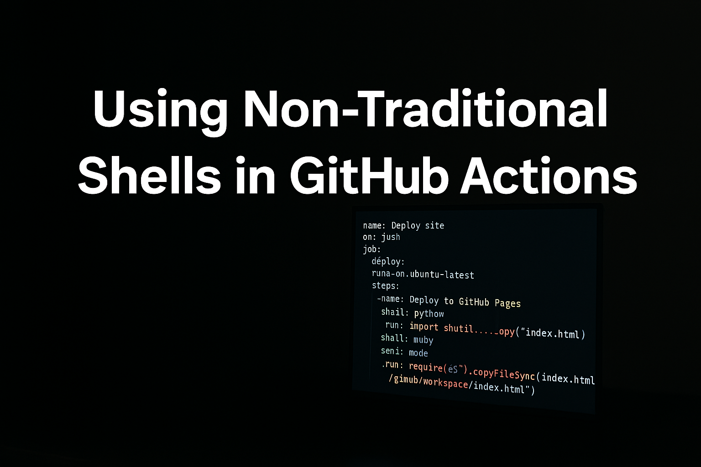

<div style="text-align: center;">
  
</div>

## Any Program Can Be a GitHub Actions Shell

While setting up my website to deploy automatically using GitHub Pages, I stumbled upon an interesting realization: any program can become a shell in GitHub Actions. This flexibility opens a world of possibilities beyond traditional shell scripting.

GitHub Actions workflows traditionally run bash or PowerShell commands. But you're not limited to just these options; you can specify any interpreter—Python, Node.js, even custom-built executables. Let's explore a couple of quick, practical examples:

### Example 1: Using Python Directly in GitHub Actions
```yaml
- name: Run Python script directly
  shell: python
  run: |
    import os
    print("The current working directory is:", os.getcwd())
```

Here, instead of calling a Python file from bash, the Python code is directly embedded, making your workflows clearer and simpler.

### Example 2: Using Node.js as a Shell
```yaml
- name: Run JavaScript code directly
  shell: node
  run: |
    const os = require('os');
    console.log(`System uptime is ${os.uptime()} seconds.`);
```

This is incredibly powerful because it lets you leverage the full ecosystem and capabilities of your chosen runtime directly within GitHub Actions workflows.

This realization has changed how I think about GitHub Actions—it’s not just automation scripts, but a flexible execution environment capable of integrating seamlessly with almost any programming language or runtime.

